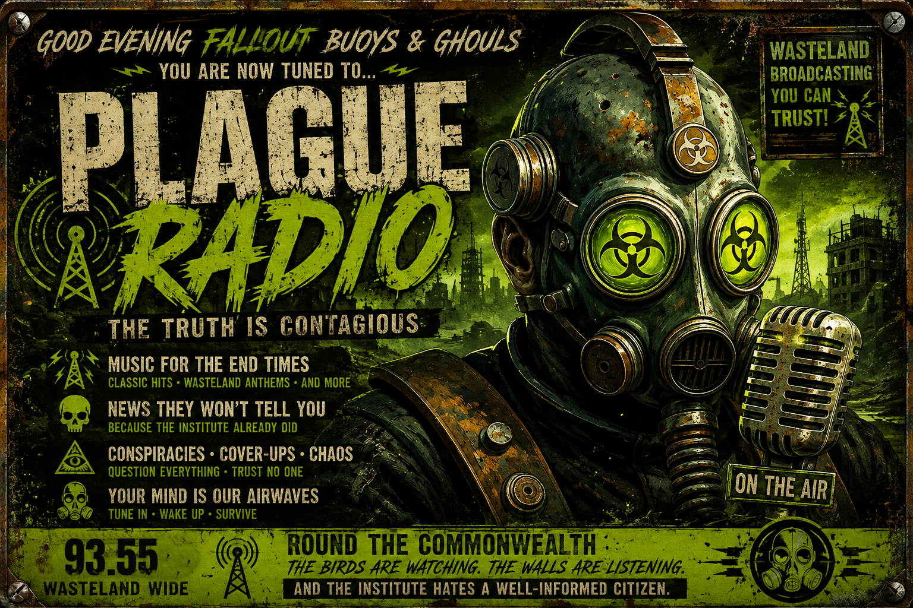

## **📻 Plague Radio**

### By Kaotick Jay



**Plague Radio is a custom Fallout 4 radio station featuring two NPC DJs.**

The first is, *Mister The Plague*: a paranoid late-night pirate radio host broadcasting from "somewhere the Institute definitely does not know about." Armed with aging analog equipment, a microphone, and an unshakable belief that the Institute is quietly replacing humanity one person at a time, he's determined to warn anyone willing to listen.

Or at least anyone who hasn't already been replaced.

> I'm Mister The Plague, reminding you that the birds are watching, the walls are listening, and the Institute hates a well-informed citizen.

Between a curated selection of lore-friendly music written exclusively for Plague Radio, *Mister The Plague* delivers conspiracy-fueled commentaries, questionable public service announcements, and increasingly unhinged warnings about synths, Institute surveillance, suspicious ravens, mysterious teddy bear scenes, and the many signs that something just isn't right in the Commonwealth.

Is he completely insane?

Maybe.

But every once in a while...

...he says something that makes you wonder.

The second host, *Tal Conroy*, is a calm, observant Commonwealth broadcaster who couldn't be more different. Where *Plague* sees Institute conspiracies around every corner, Tal simply shares stories, observations, and the quieter side of life in the Wasteland. She's thoughtful, optimistic, and treats even the Commonwealth's strangest moments as just another part of surviving after the bombs.

For example: the "Teddy bear situation". *Plague* sees these as "dead drops" - secret Institute communiques planning movements and snatchings. Tal, on the other hand, sees the same scenes as someone expressing their "odd sense of humor":

> This is Plague Radio. I'm Tal, your host... and I have a question.
> Who keeps putting these teddy bears in these strange little scenes all over the Commonwealth?
> Whoever it is...
> You've got a VERY odd sense of humor.

For obvious reasons, Tal handles the ad segments too:

> Here's a word from our sponsors:

> 'Still drinkin' that Slocum's Joe? Even after the bombs fell, it's the finest brew in the wastes. Now with 40 percent less rads'

Tal is still in development and her broadcasts, stories, and station content will be added in future updates.

✨ Features

* 📻 A fully custom Fallout 4 radio station.
* 🎙️ *Mister The Plague*, an original DJ with conspiracy-filled commentary and late-night pirate broadcasts.
* 🎙️ *Tal Conroy*, a second DJ offering a calmer, story-driven perspective on life in the Commonwealth. *(Still in development.)*
* 🎵 A curated selection of lore-friendly music written exclusively for Plague Radio.
* 📢 Original station IDs, public service announcements, advertisements, and in-universe broadcast segments.
* 🔀 Intelligent shuffle logic for a more natural listening experience with fewer repeated tracks.

✨ Features

* 📻 A fully custom Fallout 4 radio station.
* 🎙️ *Mister The Plague*, an original DJ with conspiracy-filled commentary and late-night pirate broadcasts.
* 🎙️ *Tal Conroy*, a second DJ offering a calmer, story-driven perspective on life in the Commonwealth. *(Still in development.)*
* 🎵 A curated selection of lore-friendly music written exclusively for Plague Radio.
* 📢 Original station IDs, public service announcements, advertisements, and in-universe broadcast segments.
* 🔀 Intelligent shuffle logic for a more natural listening experience with fewer repeated tracks.

### 🎵 31 Original Lore-Friendly Songs

1. Another Settlement Needs Our Help
2. Ashes and Dust
3. Born to Run the Wasteland
4. Broken Roads
5. Bullets, Bombs and Broken Dreams
6. Dead Air
7. Don't Answer the Radio
8. Let It Stay Gone
9. Mister The Plague Is Calling
10. My Name Is The Plague
11. Neon Graveyard
12. Nothing Is What It Seems
13. Radioactive Love
14. Radioactive Nights
15. The Day the Radios Died
16. The Institute Is Listening
17. The Last Radio on Earth
18. The Man They Call The Plague
19. The Old World Is Gone
20. The Voice in the Static
21. The Wasteland Is My Home
22. The Wasteland Never Dies
23. They're Already Here
24. They're Watching You
25. Thunder in the Wire
26. Turn It Up
27. Walking in the Wasteland
28. War Never Changes
29. Wasteland Heart
30. Welcome to the End
31. Yet Another Settlement Needs Our Help

So tune in, keep one eye on your neighbors...

...and maybe start paying a little more attention to those ravens.

> I'm *Mister The Plague*, broadcasting from somewhere the Institute definitely does not know about. Stay loud, stay paranoid, and keep your radio analog.

☣️ Welcome to the infection.

👀 Just to be safe...

I'm checking folks' eyes from now on.

### Installation

#### Option 1: Clone the Repository with Git

```
mkdir -p ~/git/plagueradio
cd ~/git/plagueradio
git clone https://github.com/Plagued-Mods/PlagueRadio.git
```

#### Option 2: Download the ZIP

1. Download the repository as a ZIP file.
2. Extract the ZIP file.
3. Open the extracted folder.

After cloning or extracting the ZIP, move the `Data` folder and all of its contents into your Fallout 4 installation directory.

Enable the plugin in the in-game Creations manager or your `Plugins.txt`

Alternatively, you can drop the ZIP archive into Vortex to install

**That's it.**

Once you're in the game, Plague Radio is Commonwealth-wide - you can find it in your Pip-Boy radio stations as soon as you pick up the Pip-Boy in Vault 111. Just select it and enjoy.
